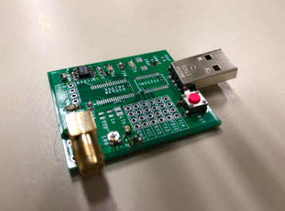

# Through The Earth Communications

An engineering final year design project designed to send arbitrary data through earthy media.

[Check out the design blog!](https://sites.google.com/view/tte-boys/home) 

Or try a `python` implementation that sounds like R2D2 using your own computer! Files in `Root/Demo`. (Dirt not required).

 
 


## File structure
```
Root
└───Hardware
│   │   Gerbers,BOM
│   │   Eagle Files
└───MODEM Code
    └───MSP
        | MSP430 OOK Modem (Final Implementation)
    └───Arduino
        | Arduino NRZ MODEM
    └─── Audio - Python
        | PC FSK MODEM
```


